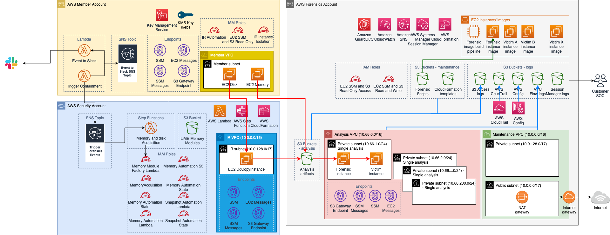
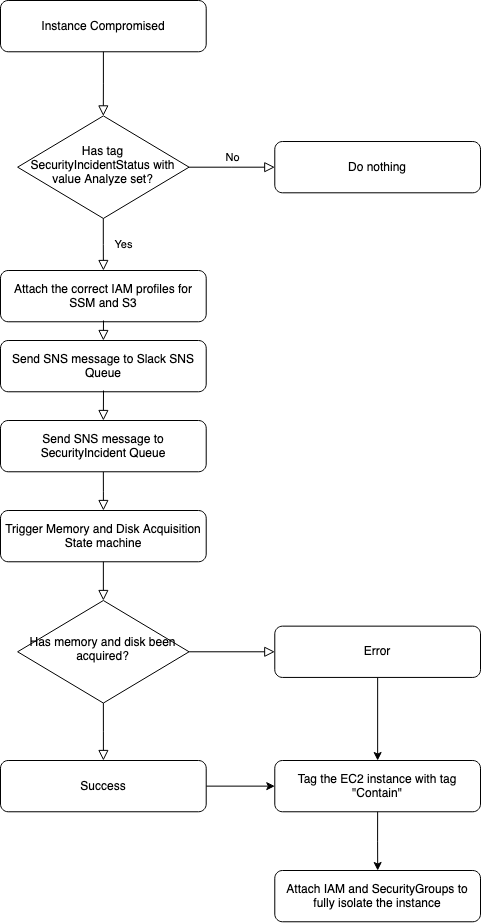
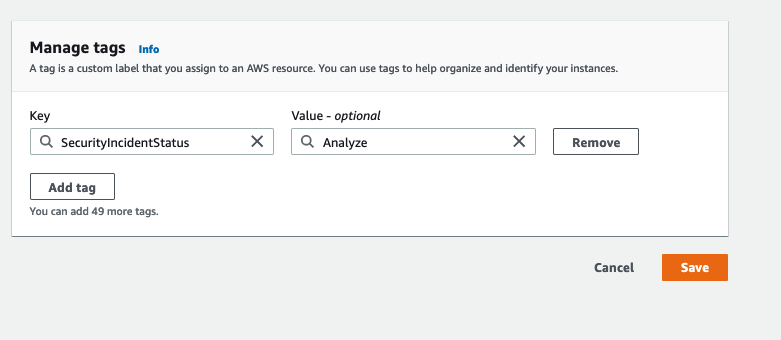
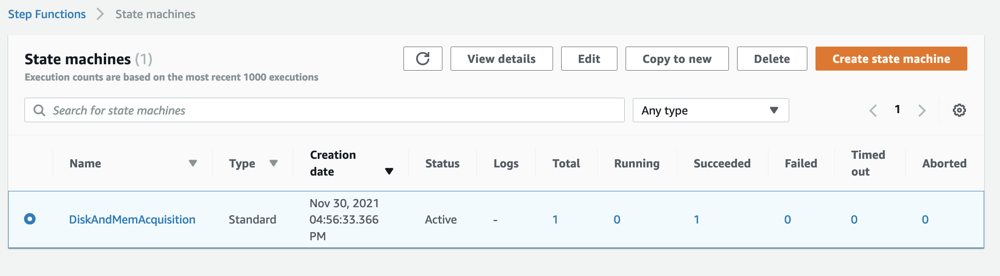
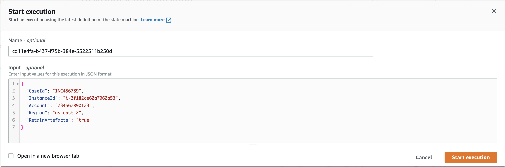
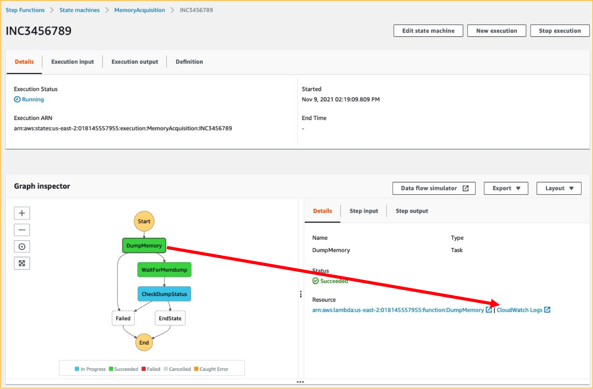
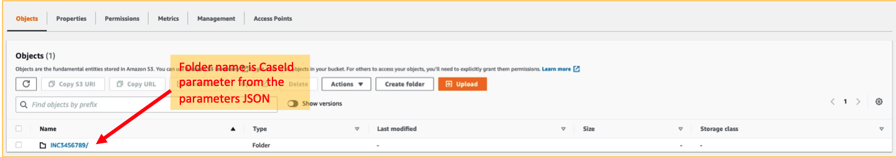
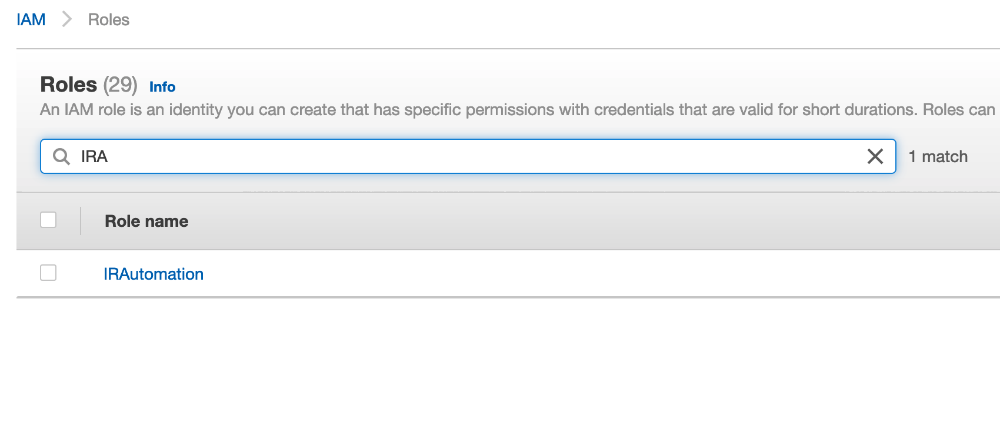

# Automated Incident Response and Forensics Framework


## Use Case

This use-case was developed for a customer in the automotive industry operating a large set of accounts. Their problems were:
- Incident Response and Forensics was a manual process prone to mistakes
- Time-consuming process with many steps 
- Hard to perform by non-trained personnel 

To address this we created the Automated Incident Response and Forensics framework. The framework aims to facilitate automated steps for incident response and forensics based on the [AWS Incident Response White Paper](https://docs.aws.amazon.com/whitepapers/latest/aws-security-incident-response-guide/welcome.html). 

## Goals
The goal is to provide a set of processes enabled by Lambda functions as to: 
- Provide an easy way to trigger the IR process with minimum knowledge
- Provide an automated repeatable processes, alligned with the AWS IR White Paper
- Provide segregation of accounts to operate the automation steps, store artifacts and create forensic environments 

## Limitations
Note that this framework does not intend to generate artifacts which can be considered as electronic evidence, submissible in court.  

## Overview of the Framework

Automated Incident Response and Forensics follows a standard digital forensic process (or phases) consisting of:
- Containment
- Acquisition
- Examination 
- Analysis 

Investigations can be performed on static data (e.g. acquired memory or disk images) as well as dynamic, “live” but segregated systems. 

By using this environment, a Security Operations Centre team can improve their security incident response process through: 
- Having ability to perform forensics in a segregated environment to avoid accidental compromise of production resources
- Having a standardized, repeatable, automated process to do containment and analysis.
- Allowing for any environment owner to trigger the IR process with the minimal knowledge required to be on how to do use tags
- Having a standardized, clean environment to perform incident analysis and forensics without the noise of a larger environment
- Having the ability to create multiple analysis environments in parallel
- Focusing SOC resources on incident response and not maintenance and documentation of a cloud forensics environment
- Moving away from manual hands-on process towards an automated one to achieve scalability
- Using scripts for consistency and to avoid repeatable tasks

Additionally, customers will avoid using persistent infrastructure and pay for resources when they need them.

## Architecture
The environment will consist of 2 main accounts – a Security and a Forensics accounts. The reason for having 2 accounts is to separate them from any other customer accounts to reduce blast radius in case of a failed forensic analysis, ensure the isolation and protection of the integrity of the artifacts being analyzed, and keeping the investigation confidential. Separate accounts also avoid situations where the threat actors might have used all the resources immediately available to your compromised AWS account by hitting service quotas and so preventing you from instantiating an Amazon EC2 instance to perform investigations. Also, having separate Security and Forensic account allows for creating separate roles – a Responder for acquiring evidence and an Investigator for analyzing it. Each of the roles would have access to their separate accounts.

The Security account is where the 2 main Step Functions are created for memory and disk image acquisition. Once running, those reach into the Member account (an account with the EC2 instances involved in an incident) and trigger a set of Lambda functions that will gather either a memory or disk dump. Those artifacts are then stored in the Forensics account.

A Forensics account will hold the artifacts gathered by the Step Functions in the “Analysis artifacts” S3 bucket.
The Forensics account will also have a EC2 Image Builder pipeline that builds an AMI image of a Forensics instance. Currently it’s based on SANS SIFT Workstation (https://www.sans.org/tools/sift-workstation/). The build process uses the Maintenance VPC which has connectivity to the Internet. 
This can be later used for spinning up EC2 instance for analysis of the gathered artifacts in the Analysis VPC. The Analysis VPC does not have Internet connectivity. By default, the AWS ProServe creates 3 analysis subnets. More subnets can be created (up to 200 which is the quota for number of subnets in VPC) but the VPC endpoints need to have those subnets added for SSM Sessions Manager to work in them.





## Workflow 


## Pre-requisites
1.	2 accounts
	* Security account - can be an existing account, preferably fresh
	* Forensic account - preferably fresh
2.	AWS Organizations set up
3.	In Member accounts:
 	* EC2 role needs to have access to S3 (Get / List) and be accessible by SSM. It’s suggested to use AWS managed roles:
		* AmazonSSMManagedInstanceCore
		* Note that this role will automatically be attached to the instance when IR is triggered, until the response has finished after which the IAM will remove all rights to the instance
	* VPC Endpoints need to be added to VPC and Subnets in which the target EC2 instances reside. Those endpoints are: S3 (gateway), EC2messages, SSM and SSMMessages
4.	If the EC2 instances don’t have AWS CLI installed, Internet access will be required for the disk snapshot and memory acquisition to work. In this case the scripts will reach out to the Internet to download the AWS CLI installation files and will install them on the instance in scope.

## Installing the CloudFormation scripts 
The CloudFormation scripts are marked 1 to 8, with the first word of the script name indicating in which account the script needs to be deployed. Note that the order of launching the CFN templates is important. 

- 1-forensic-AnalysisVPCnS3Buckets.yaml: deployed in the forensics account and creates the S3 buckets, VPCs and enables CloudTrail
- 2-forensic-MaintenanceVPCnEC2ImageBuilderPipeline.yaml:  Deploys the maintenance VPC and image builder pipeline based on SANS SIFT
- 3-security_LiME_Volatility_Factory_s3_bucket.yaml: Creates the S3 bucket where the memory modules for LiME will be stored
- 4-security_IR-Disk_Mem_automation.yaml: Deploys the functions in the security account which enable disk and memory acquisition. 
- 5-security_LiME_Volatility_Factory.yaml: Triggers a build function to start creating the memory modules based of the given AMI ids. Note that AMI ids are different across regions. Whenever you need new memory modules, you can simply re-run this script with the new AMI ids. You could consider integrating this with your golden image AMI builder pipelines (if used in your environment)
- 6-member-IR-automation.yaml: Creates the member IR automation function which triggers the IR process. It allows for sharing EBS volumes across accounts, automated posting to Slack channels during the IR process, triggering the forensics process  and isolating the instances after the process finishes.
- 7-forensic-artifact-s3-policies.yaml: After all the scripts have been deployed this script fixes the permissions required for all the cross-account interactions. 
- 8-security-IR-vpc.yaml: Configures a VPC used for IR volume processing


## Operating the Incident Response Framework
The incident response framework can be triggered by creating a Tag with key `SecurityIncidentStatus` and value `Analyze` for a given EC2 instance. This will trigger the member Lambda function that will automatically start isolation and memory/disk acquisition. It will also re-tag the asset at the end (or on failure) with `Contain`. This triggers the containment which fully isolates the instance with a no INBOUND/OUTBOUND security group and with an IAM role that disallows all access.

When an EC2 instance is compromised or suspect to be compromised, a tag must be attached to it  with as key SecurityIncidentStatus with as value either "Analyze" or "Contain" (note that this is case sensitive).

This can be done from the console:



Or use the AWS CLI `aws ec2 create-tags --resources <instance-id> --tags Key=SecurityIncidentStatus,Value=Contain`

The tag change event will be forwarded to the Lambda function which will evaluate the tag value
If the tag value matches the analyze or containment value it will proceed with executing the containment actions:

- Enable Termination Protection
- For "Analyze":
	- Attach the correct IAM profiles required for SSM and S3
	- Send an SNS message to the Security Incident response SNS topic in the security account to trigger the automated flow
- For "Contain":
	- Attach an IAM profile which disables any access to the AWS API
	- Create and attach a security group that prevents any in- and outbound traffic


The flow can also be triggered directly from the security account directly through the stepfunction:


In the pop-up form, fill out the required details. The “Name” field of the execution if optional but helps to identify previous executions (as seen on screen above in point 4.)

The “Input” field, although described as optional, is in fact required by the Memory and Disk Acquisition state machines. It provides required parameters for the underlying scripts to run successfully. The format used is JSON.
The following parameters are used:
1.	CaseId – String for case ID. It can be anything that helps you map it to your security incident management system. The fully automated system generates this automatically. 
2.	InstanceId – the ID of the instance on which you intend to perform the memory or disk acquisition
3.	Account – the Member account number where the instance is running
4.	Region – the region name where the instance is running
5.	RetainArtefacts – should the volume snapshots be also left in the Security account after they have been processed and stored in the Forensic Account in the IR-Artifacts bucket


An example execution JSON:
```
{
  "CaseId": "INC456789",
  "InstanceId": "i-3f182ce62a7962a53",
  "Account": "234567890123",
  "Region": "us-east-2",
  "RetainArtefacts": "true"
}
```
6.	After the necessary parameters have been provided, press the “Start execution” button on the bottom right.

7.	As the state machine execution progresses, you can check the details of each step. Click on a completed step (marked in green) and then click the link to see the CloudWatch Logs. This functionality is useful in case of a need to troubleshoot.


8.	After a successful execution of the state machine, the artifacts can be found in the Forensics Account in the “<account number>-ir-artifacts” S3 bucket.
The artifacts will be in the folder named after the CaseId parameter:
 

## SecurityHub Actions
If you want to create a custom action so that you can use the dropdown box from Security Hub, you can deploy the CFN template found under “modules/Security Hub Custom Actions“. Subsequently you will need to modify the ”IRAutomation“ role in each of the member accounts to allow the Lambda function that executes the action to assume the ”IRAutomation“ role. 



To do this, go to each member account, find the “IRAutiomation” IAM role: 
[Image: image.png]And subsequently add “arn:aws:iam::9999999:role/SecurityHubCustomActionLambdaRole” (replace 9999999 with your security account id) so that the policy looks like this:
```
{
   "Version":"2012-10-17",
   "Statement":[
      {
         "Effect":"Allow",
         "Principal":{
            "AWS":[
               "arn:aws:iam::9999999:role/MemoryAutomationLambdaRole",
               "arn:aws:iam::9999999:role/SnapshotAutomationLambdaRole",
               "arn:aws:iam::9999999:role/SecurityHubCustomActionLambdaRole"
            ]
         },
         "Action":"sts:AssumeRole"
      }
   ]
}
```
Once you have done that you can trigger responses on EC2 events by using the actions dropdown in SecurityHub as shown above.


## Future Roadmap
- Support for Windows
- Support for ARM based AMIs 
- Better way of generating memory modules automatically without having to recreate the CloudFormation stack


